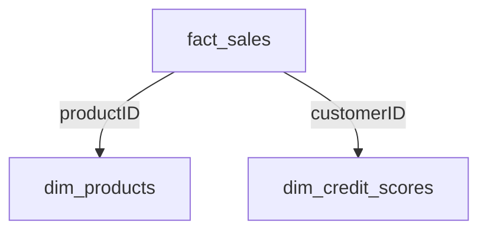

# Solución Reto 03 — Modelo Semántico, Data Agent y Dashboard de Valor (Capa Gold)

## Objetivo
Construir un ecosistema analítico completo en Microsoft Fabric que permita:
- Crear un modelo semántico Gold con datos curados
- Habilitar consultas en lenguaje natural vía Data Agent
- Diseñar visualizaciones efectivas en Power BI

## Requisitos previos
- Tablas Silver con datos limpios y transformados
- Workspace en Microsoft Fabric con permisos de administrador
- Power BI Desktop instalado (opcional, se puede usar Fabric web)

## 1. Preparar tablas Gold y relaciones

## Score Crediticio
```python 


from pyspark.sql.functions import col
from pyspark.ml.feature import VectorAssembler
from pyspark.ml.clustering import KMeans

# Cargar tabla Silver (ya limpia desde Dataflow)
df_fin = spark.read.table("silver_financiero")

# Transformación intermedia: normalizar score
score_min = df_fin.agg({"score": "min"}).collect()[0][0]
score_max = df_fin.agg({"score": "max"}).collect()[0][0]
df_fin = df_fin.withColumn("score_normalizado", (col("score") - score_min) / (score_max - score_min))

# ML: clustering por score normalizado
features_fin = VectorAssembler(inputCols=["score_normalizado"], outputCol="features")
df_fin_vec = features_fin.transform(df_fin)

kmeans = KMeans(k=3, seed=42)
model_fin = kmeans.fit(df_fin_vec)
df_fin_clustered = model_fin.transform(df_fin_vec)

# Selección: clientes del cluster con score más alto
top_cluster = df_fin_clustered.groupBy("prediction").avg("score_normalizado").orderBy("avg(score_normalizado)", ascending=False).first()[0]
df_gold_fin = df_fin_clustered.filter(col("prediction") == top_cluster)

# Guardar en Gold
df_gold_fin.write.mode("overwrite").saveAsTable("gold_financiero")


```

## Retail 

```python 
# Segmentación ML + Promoción a Gold (Retail por producto)

# 📌 Importar funciones necesarias
from pyspark.sql.functions import col, when, udf
from pyspark.sql.types import StringType
from pyspark.ml.feature import VectorAssembler
from pyspark.ml.clustering import KMeans

# 🟦 1. Cargar tabla Silver con catálogo de productos retail
df_retail = spark.read.table("productos_silver")

# 🧮 2. Derivar columna valor_comercial = Price × Stock
df_retail = df_retail.withColumn("valor_comercial", col("Price") * col("Stock"))

# 🧮 3. Derivar columna disponibilidad_binaria
df_retail = df_retail.withColumn("disponible",
    when(col("Availability") == "InStock", 1).otherwise(0)
)

# 🧹 4. Filtrar registros válidos para clustering
df_retail_clean = df_retail.filter(
    col("valor_comercial").isNotNull() & col("disponible").isNotNull()
)

# 📊 5. Vectorizar columnas para ML
assembler = VectorAssembler(inputCols=["valor_comercial", "disponible"], outputCol="features")
df_retail_vec = assembler.transform(df_retail_clean)

# 🤖 6. Aplicar KMeans clustering para segmentar productos
kmeans = KMeans(k=3, seed=42)
model_retail = kmeans.fit(df_retail_vec)
df_retail_clustered = model_retail.transform(df_retail_vec)

# 🏷️ 7. Etiquetar productos según valor comercial promedio por cluster
cluster_scores = df_retail_clustered.groupBy("prediction") \
    .avg("valor_comercial") \
    .orderBy("avg(valor_comercial)", ascending=False) \
    .collect()

# Crear mapa de etiquetas: Valioso, Medio, Bajo
cluster_map = {}
for i, row in enumerate(cluster_scores):
    cluster_map[row["prediction"]] = ["Valioso", "Medio", "Bajo"][i]

# UDF para asignar etiqueta
def map_cluster(pred):
    return cluster_map.get(pred, "Desconocido")

map_udf = udf(map_cluster, StringType())
df_segmentado = df_retail_clustered.withColumn("perfil_producto", map_udf(col("prediction")))

# 🔍 8. Conteo por perfil (opcional para validación)
df_segmentado.groupBy("perfil_producto").count().orderBy("count", ascending=False).show()

# 🥇 9. Filtrar productos valiosos y disponibles
df_gold_retail = df_segmentado.filter((col("perfil_producto") == "Valioso") & (col("disponible") == 1))

# 💾 10. Guardar tabla Gold con productos valiosos
df_gold_retail.write.option("mergeSchema", "true").mode("overwrite").saveAsTable("productos_gold")
```

### 1.1 Crear tablas dimensionales
```sql
-- En Fabric Lakehouse, crear vista Gold de productos
CREATE OR REPLACE TABLE gold.dim_products AS
SELECT 
    productID,
    Brand,
    Category,
    perfil_producto,
    availability,
    Price as unit_price,
    Stock as current_stock
FROM silver.productos_clean;

-- Crear vista Gold de scores crediticios
CREATE OR REPLACE TABLE gold.dim_credit_scores AS
SELECT 
    customerID,
    score_normalizado,
    segmento_score,
    fecha_actualizacion
FROM silver.credit_scores_clean;
```

### 1.2 Crear tabla de hechos (ventas)
```sql
CREATE OR REPLACE TABLE gold.fact_sales AS
SELECT 
    s.saleID,
    s.productID,
    s.customerID,
    s.sale_date,
    s.quantity,
    s.unit_price,
    s.quantity * s.unit_price as valor_comercial,
    s.is_returned
FROM silver.sales_clean s;
```

## 2. Diseñar Modelo Semántico

### 2.1 Definir relaciones
En Power BI o Fabric, establecer:
- `fact_sales[productID]` → `dim_products[productID]` (muchos a uno)
- `fact_sales[customerID]` → `dim_credit_scores[customerID]` (muchos a uno)

### 2.2 Crear medidas DAX básicas
```dax
-- Medidas de ventas
Valor_Comercial_Total = SUM(fact_sales[valor_comercial])

Productos_Disponibles = 
CALCULATE(
    COUNTROWS(dim_products),
    dim_products[availability] = "In Stock"
)

-- Medidas de scores
Score_Promedio = AVERAGE(dim_credit_scores[score_normalizado])

-- KPIs derivados
Tasa_Devolución = 
DIVIDE(
    CALCULATE(COUNTROWS(fact_sales), fact_sales[is_returned] = TRUE),
    COUNTROWS(fact_sales)
)
```

### 2.3 Crear jerarquías útiles
```dax
-- Jerarquía de productos
Productos = 
HIERARCHY(
    dim_products[Brand],
    dim_products[Category],
    dim_products[productID]
)

-- Jerarquía temporal
Tiempo = 
HIERARCHY(
    fact_sales[sale_date],
    'Year',
    'Quarter',
    'Month'
)
```

## 3. Configurar Data Agent

### 3.1 Crear y conectar agente
1. En Fabric → New → Data Agent
2. Nombre: "Contoso_Retail_Agent"
3. Conectar al modelo semántico Gold
4. Habilitar preguntas frecuentes:
   ```json
   {
     "frequently_asked": [
       "¿Qué categoría tiene más productos valiosos?",
       "¿Cuál es el valor comercial total por marca?",
       "¿Cuántos productos están disponibles?",
       "¿Qué perfil de producto genera más ingresos?"
     ]
   }
   ```

### 3.2 Probar consultas de validación
```plaintext
Test 1: "Muestra el top 5 de marcas por valor comercial"
Expected: Tabla/gráfico con marcas ordenadas por Valor_Comercial_Total

Test 2: "¿Cuál es el score promedio por segmento?"
Expected: Agregación de Score_Promedio por segmento_score
```

## 4. Crear Dashboard en Power BI
=======
# **Reto 3 – Modelo semántico, Data Agent y Dashboard de valor (Gold) 💎📊**

## **Guía paso a paso para la creación de soluciones en Power BI ⚙️**

### **Objetivo 🎯**
Crear un **modelo semántico**, un **Data Agent** y un **dashboard** sencillo en **Power BI**.

### 4.1 Diseño de páginas
1. **Overview Financiero**
   - KPI: Score promedio global
   - Gráfico de barras: Score por segmento
   - Línea temporal: Evolución de scores

<<<<<<< HEAD
2. **Análisis de Ventas**
   - Treemap: Valor comercial por categoría/marca
   - Tabla: Top 10 productos por ventas
   - Gráfico de líneas: Tendencia mensual de ventas

3. **Productos y Stock**
   - Gauge: % productos disponibles
   - Matriz: Stock por categoría
   - Scatter: Precio vs Stock con perfil_producto

### 4.2 Ejemplo de configuración visual (Power BI)
```yaml
# Configuración del Treemap de Valor Comercial
Visual: Treemap
Fields:
  - Category (Group)
  - Brand (Subgroup)
  - Valor_Comercial_Total (Size)
Colors: 
  - Scheme: "Corp Blue to Red"
  - By: Valor_Comercial_Total
Title: "Valor Comercial por Categoría y Marca"
```

## 5. Validación y Pruebas

### 5.1 Checklist de validación
- [ ] Todas las relaciones están en modo single (no bidirectional)
- [ ] Medidas DAX devuelven resultados esperados
- [ ] Data Agent responde correctamente a preguntas de negocio
- [ ] Dashboard se actualiza con datos nuevos
- [ ] Permisos asignados correctamente

### 5.2 Pruebas de rendimiento
```dax
-- Medida para validar tiempo de respuesta
Tiempo_Respuesta = 
VAR Start = NOW()
VAR Result = [Medida_Compleja]
RETURN
DATEDIFF(Start, NOW(), MILLISECOND)
```

## 6. Documentación

### 6.1 Diccionario de medidas
| Medida | Descripción | DAX |
|--------|-------------|-----|
| Valor_Comercial_Total | Suma total de ventas | `SUM(fact_sales[valor_comercial])` |
| Productos_Disponibles | Conteo de productos en stock | `CALCULATE(COUNTROWS(dim_products),dim_products[availability] = "In Stock")` |

### 6.2 Relaciones y dependencias


## Referencias
- [Docs: Semantic Models in Fabric](https://learn.microsoft.com/fabric/data-warehouse/semantic-models)
- [Power BI DAX Reference](https://learn.microsoft.com/dax/)
=======
## **Narrativa contextual y pasos sugeridos 🧭**

### **Contexto 🏢**
Contoso quiere habilitar análisis de negocio sobre datos confiables.  
Tu equipo debe construir un **modelo semántico**, crear un **Data Agent** y diseñar un **dashboard** simple pero útil.

### **Objetivo del reto 🎯**
Diseñar el modelo semántico en **Gold**, crear un **Data Agent** conectado a ese modelo y construir un **dashboard** que entregue **valor al negocio**.

---

## **Fuentes de referencia 📚**
- [Modelos semánticos de Power BI - Microsoft Fabric | Microsoft Learn](https://learn.microsoft.com/power-bi/)
- [Actualizar un modelo semántico mediante canalizaciones de datos (versión preliminar) - Power BI | Microsoft Learn](https://learn.microsoft.com/power-bi/connect-data/service-dataflows-semantic-models)

---

## **Pasos sugeridos 🪜**

1. Crear **tabla Gold** con agregaciones y relaciones clave.  
2. **Definir relaciones** si hay múltiples tablas.  
   - Ejemplo: si existe una tabla de clientes o transacciones, crear relaciones por `productID`.  
3. **Diseñar el modelo semántico** (medidas, dimensiones).  
   - Asegurarse de incluir medidas como:  
     - `valor_comercial_total = SUM(valor_comercial)`  
     - `productos_disponibles = COUNTIF(availability = "In Stock")`  
4. **Validar preguntas comunes** en **Copilot** o **Power BI** para asegurar que el modelo responde correctamente.  
5. Crear un **Data Agent en Fabric** conectado al modelo.  
6. **Diseñar un dashboard** en Power BI con visualizaciones como:  
   - **Score promedio por segmento (financiero)**.  
   - **Productos más vendidos y tasa de devolución (retail)**.  
   - **Tendencias semanales o mensuales**.  
7. **Publicar el dashboard** en el workspace.  

---

## **Reto 3 – Industria Retail (Set: score_productos_gold) 🛍️**

### **1️⃣ En Power BI, crea un modelo semántico**
Incluir las dimensiones siguientes:
- `Brand`
- `Category`
- `perfil_producto`
- `availability`

---

## **Medidas DAX sugeridas 🧮**

| **Medida** | **Fórmula DAX sugerida** |
|-------------|---------------------------|
| `Valor_Comercial_Total` | `SUM(score_productos_gold[valor_comercial])` |
| `Productos_Disponibles` | `COUNTROWS(FILTER(score_productos_gold, score_productos_gold[Availability] = "InStock"))` |
| `Cantidad_Productos` | `COUNT(score_productos_gold[ProductoID])` |
| `Tasa_Devolucion` | `AVERAGE(score_productos_gold[Devolucion_Binaria])` |

---

## **Validación de preguntas comunes 💬**

Prueba estas preguntas en **Copilot** o **Power BI** para validar el modelo:

- “¿Qué categoría tiene más productos valiosos?” 
- “¿Cuál es el valor comercial total por marca?” 
- “¿Cuántos productos están disponibles?” 
- “¿Qué perfil de producto genera más ingresos?”

---

## **Crea un dashboard llamado con las siguientes visualizaciones 📊**

| **Visualización** | **Tipo** | **Fuente** |
|--------------------|----------|-------------|
| 📈 Valor comercial por categoría | Gráfico de columnas | `score_productos_gold` |
| 📉 Tendencia mensual de disponibilidad | Línea temporal | `score_productos_gold` |
| 🛒 Productos más vendidos por marca | Gráfico de barras | Relación con transacciones (si aplica) |
| 🔄 Tasa de devolución por perfil | Gráfico circular | `score_productos_gold` |
| 📦 Segmento de producto vs volumen | Tabla + tarjeta | `score_productos_gold` |

---

## **Publicar el dashboard en el workspace 🚀**

- Publica el dashboard en el **workspace correspondiente**.  
- Asegúrate de que el **Data Agent** esté activo para responder preguntas desde **Copilot** o **Power BI**.  
